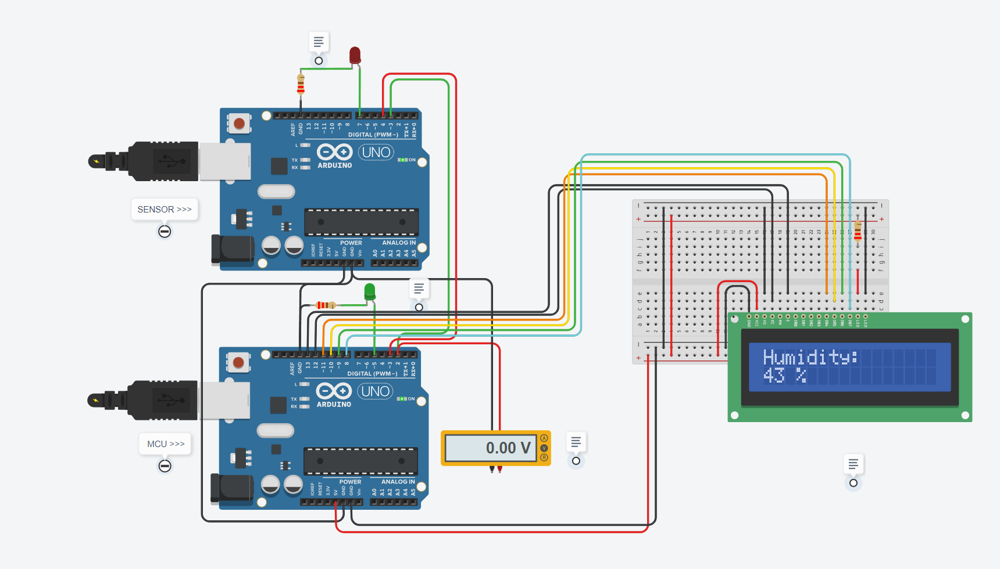

# Embeded_system_humidity_control

**Developer:** Emmanuel Moulun 
**Project type:** Student project 
**Demo:** https://www.tinkercad.com/things/kGRFB8gZKBh?sharecode=yOR_8oL2bx_vJ1KffzxQbN-uIS7YKyPal8njOvRnI1A

### Description:
This project involved simulating a humidity sensor using a microcontroller and processing the data on another microcontroller to display the humidity on an LCD screen.
The code was designed to operate at the register level to maximize memory efficiency and execution speed.

### Features:
1. Display the humidity

### Technologies:
Language C with register level programming.

### License:
GNU GPLv3

